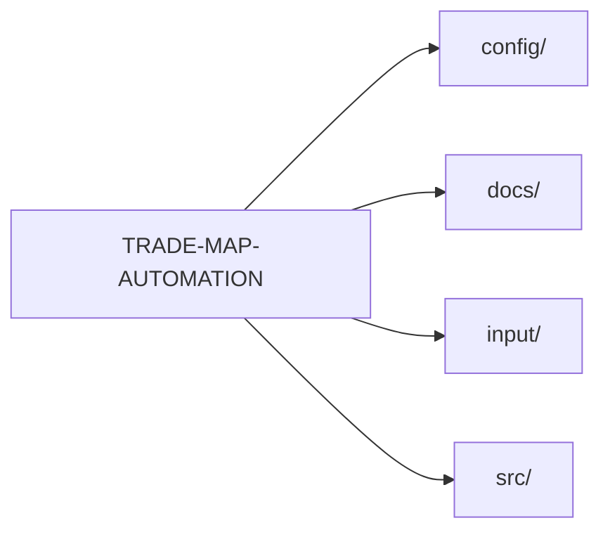

# TRADE-MAP-AUTOMATION

> 📦 Automated ITC Trade Map data processor 📈 featuring customizable speed profiles ⚙️ and rate-limit safety 🔒.


## Why this exists

📦 Automated ITC Trade Map data processor 📈 featuring customizable speed profiles ⚙️ and rate-limit safety 🔒. The codebase is written primarily in TypeScript.

**Topics:** `ai` · `auto` · `automation` · `automation-highway` · `software-engineering`

**Homepage:** https://www.trademap.org/en/

## Tech stack

| Technology | Role | How it's used |
| --- | --- | --- |
| TypeScript | Language | 100% of the code by bytes (GitHub language stats) |
| Playwright | Testing | playwright in package.json |

## Architecture

A TypeScript codebase.



**Entry points:** `src/index.ts`

## Getting started

```bash
git clone https://github.com/AazikoGlobalLLP/TRADE-MAP-AUTOMATION.git
cd TRADE-MAP-AUTOMATION
npm install
npm run dev
npm run start
```

Every command above exists in the repository:

- `npm install` — install JavaScript dependencies (package.json present)
- `npm run dev` — package.json "dev" script:
- `npm run start` — package.json "start" script: node dist/index.js

## Project structure

```text
TRADE-MAP-AUTOMATION/
├── config/  # configuration
├── docs/    # documentation
├── input/
└── src/     # application source code
```

## CI & testing

Detected test tooling:

- Playwright — playwright in package.json

## License

MIT — as declared in the repository's GitHub license metadata.

---

_README forged from the repository itself by ProfileForge (https://profileforge-one.vercel.app/project) — every claim above was detected, not guessed._
